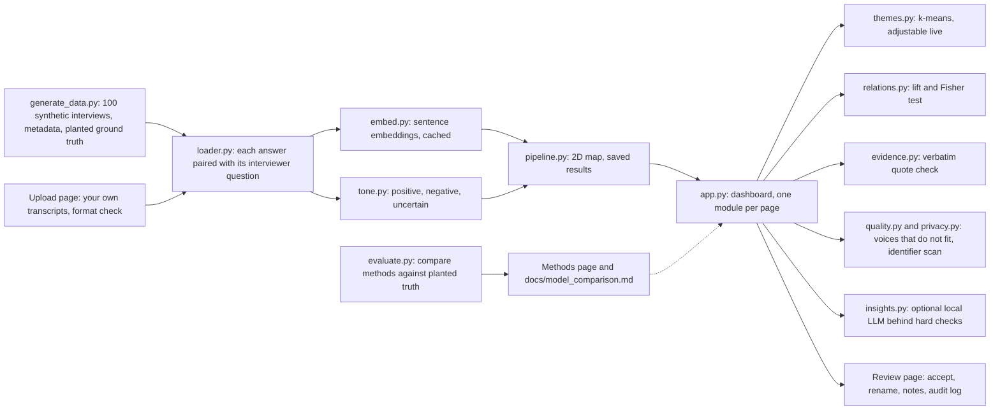
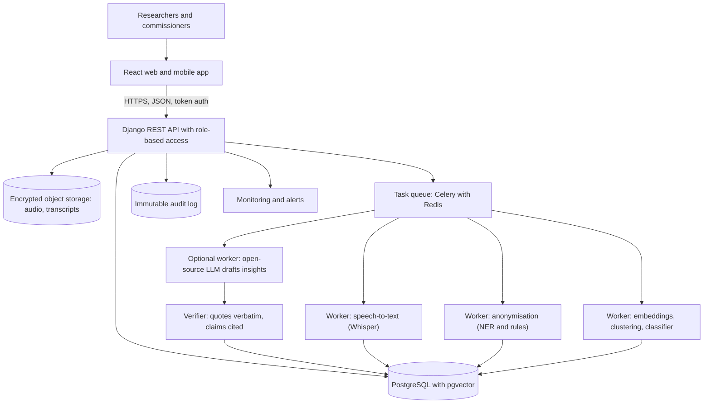

# Architecture

## A. This prototype

```mermaid
flowchart LR
    G["generate_data.py: 100 synthetic interviews, metadata, planted ground truth"] --> L
    U["Upload page: your own transcripts, format check"] --> L
    L["loader.py: each answer paired with its interviewer question"] --> E["embed.py: sentence embeddings, cached"]
    L --> T["tone.py: positive, negative, uncertain"]
    E --> P["pipeline.py: 2D map, saved results"]
    T --> P
    P --> D["app.py: dashboard, one module per page"]
    D --> TH["themes.py: k-means, adjustable live"]
    D --> R["relations.py: lift and Fisher test"]
    D --> V["evidence.py: verbatim quote check"]
    D --> Q["quality.py and privacy.py: voices that do not fit, identifier scan"]
    D --> LLM["insights.py: optional local LLM behind hard checks"]
    D --> H["Review page: accept, rename, notes, audit log"]
    EV["evaluate.py: compare methods against planted truth"] --> M["Methods page and docs/model_comparison.md"]
    M -.-> D
```

## B. Proposed secure, scalable version

```mermaid
flowchart TB
    U["Researchers and commissioners"] --> FE["React web and mobile app"]
    FE -->|"HTTPS, JSON, token auth"| API["Django REST API with role-based access"]
    API --> DB[("PostgreSQL with pgvector")]
    API --> OBJ[("Encrypted object storage: audio, transcripts")]
    API --> Q["Task queue: Celery with Redis"]
    Q --> W1["Worker: speech-to-text (Whisper)"]
    Q --> W2["Worker: anonymisation (NER and rules)"]
    Q --> W3["Worker: embeddings, clustering, classifier"]
    Q --> W4["Optional worker: open-source LLM drafts insights"]
    W4 --> VER["Verifier: quotes verbatim, claims cited"]
    VER --> DB
    W1 --> DB
    W2 --> DB
    W3 --> DB
    API --> AUD[("Immutable audit log")]
    API --> MON["Monitoring and alerts"]
```
